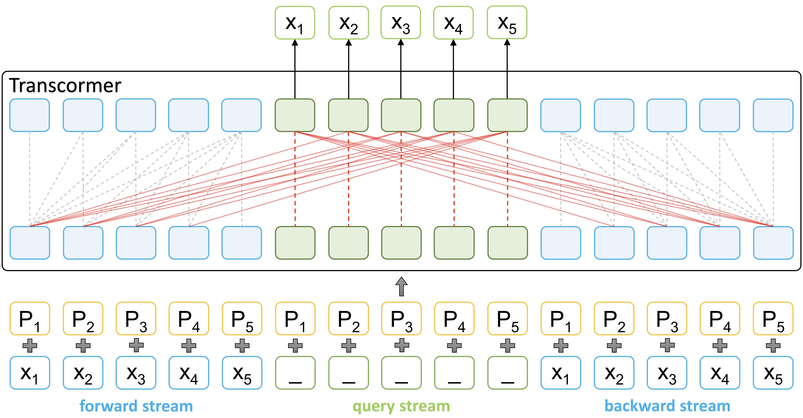

# Transcormer
[Transcormer: Transformer for Sentence Scoring with Sliding Language Modeling](https://arxiv.org/pdf/2205.12986.pdf), by Kaitao Song, Yichong Leng, Xu Tan, Yicheng Zou, Tao Qin, Dongsheng Li, NeurIPS 2022, is a Transformer-based model for sentence scoring in NLP. We introduce a novel sliding language modeling (SLM) to handle sentence scoring tasks, which allows model to predict token-wise probability within a single forward pass and both utilize bidirectional context. When compared with BERT/GPT, it achieves better performances in rescoring tasks, and it also achieves a 20x/160x speedup than BERT in CPU/GPU (since BERT needs N-passes inference).

<p align="center"><br/> The overview of Transcormer </p>

## Requirements
```bash
pip install fairseq==0.10.2 torch==1.9.0 transformers
```

## Data
We use the same data pipeline as [RoBERTa](https://github.com/facebookresearch/fairseq/blob/v0.10.2/examples/roberta/README.pretraining.md) to process corpus. For example, we use [WikiText-103 dataset](https://www.salesforce.com/products/einstein/ai-research/the-wikitext-dependency-language-modeling-dataset/) as the training corpus (you can switch it to wikipedia + bookcorpus as the pre-training corpus for reproducing). 

First download the dataset:
```bash
wget https://s3.amazonaws.com/research.metamind.io/wikitext/wikitext-103-raw-v1.zip
unzip wikitext-103-raw-v1.zip
```

Next, encode it with the RoBERTa or BERT tokenizer:


## Training 

## Inference

## Citation
If you find Transcormer useful in your work, you can cite the paper as below:
    
    @inproceedings{Kaitao2022Transcormer,
        Author    = {Kaitao Song, Yichong Leng, Xu Tan, Yicheng Zou, Tao Qin, Dongsheng Li},
        Title     = {Transcormer: Transformer for Sentence Scoring with Sliding Language Modeling},
        Booktitle = {Advances in Neural Information Processing Systems ({NeurIPS})},
        Year      = {2022}
    }
